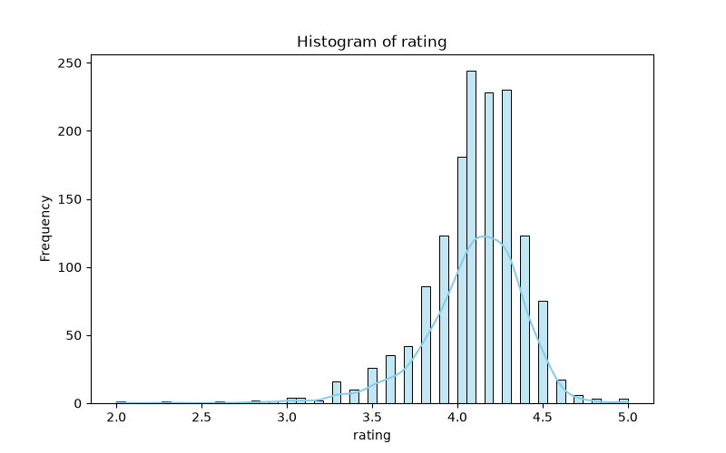
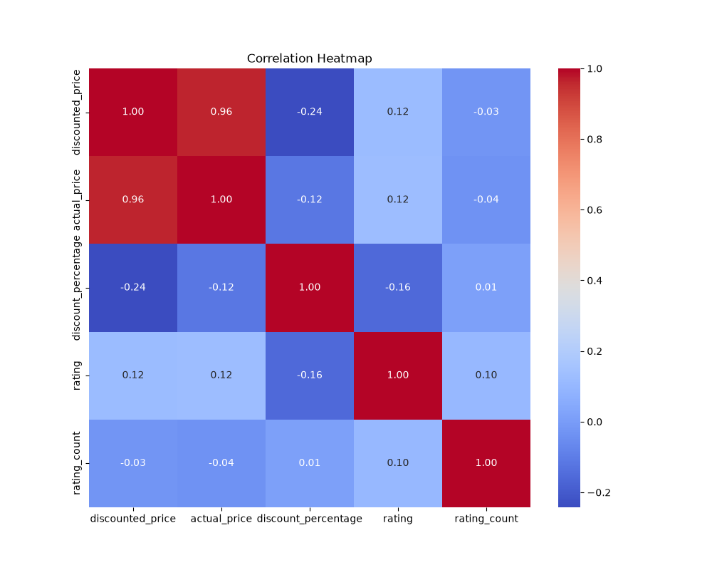

# 🛒 Amazon Dataset - Data Preprocessing

## Overview
This project demonstrates Data Preprocessing techniques applied to the Amazon Dataset. The complete workflow covers initial data exploration, descriptive data visualization, thorough data cleaning, handling of missing or anomalous elements, and systematic feature engineering to prepare the data for downstream Machine Learning models.




## Dataset
The dataset consists of various product features from Amazon, including prices, star ratings, review counts, and categorical information. The primary objective is to format and transform the raw textual and numeric metrics into an analytical-ready structure.

*   **Source:** [Kaggle - Amazon Sales Dataset](https://www.kaggle.com/datasets/karkavelrajaj/amazon-sales-dataset)

## Tasks
* **Dataset Exploration**
    * Shape Analysis (Rows & Columns)
    * Data Type Verification
    * Summary Statistics Calculation
    * Missing Values Identification
    * Duplicate Records Assessment
    * Class Distribution Tracking

* **Data Visualization**
    * Feature Distribution Analysis (Histogram)
    * Linear Relationship Matrix (Correlation Heatmap)

* **Data Cleaning**
    * String Stripping & Cleaning (Removing Currency Symbols & Commas)
    * Data Type Conversion (Object to Numeric Formats)
    * Imputation Analysis (Comparing Mean vs Median for Missing Data)
    * Final Missing Values Imputation (Using Robust Medians)
    * Duplicate Records Removal

* **Feature Engineering**
    * Label Encoding (Categorical Transformation)
    * One-Hot Encoding (Top Category Dummy Variables)

## Technologies Used
* **Python**
* **Pandas**
* **NumPy**
* **Matplotlib**
* **Seaborn**
* **Scikit-Learn**

## Project Replication & Commands
```bash
# 1. Check your Python installation environment
python --version

# 2. Install required data science packages
pip install pandas numpy matplotlib seaborn scikit-learn

# 3. Execute the preprocessing pipeline script
python than.py