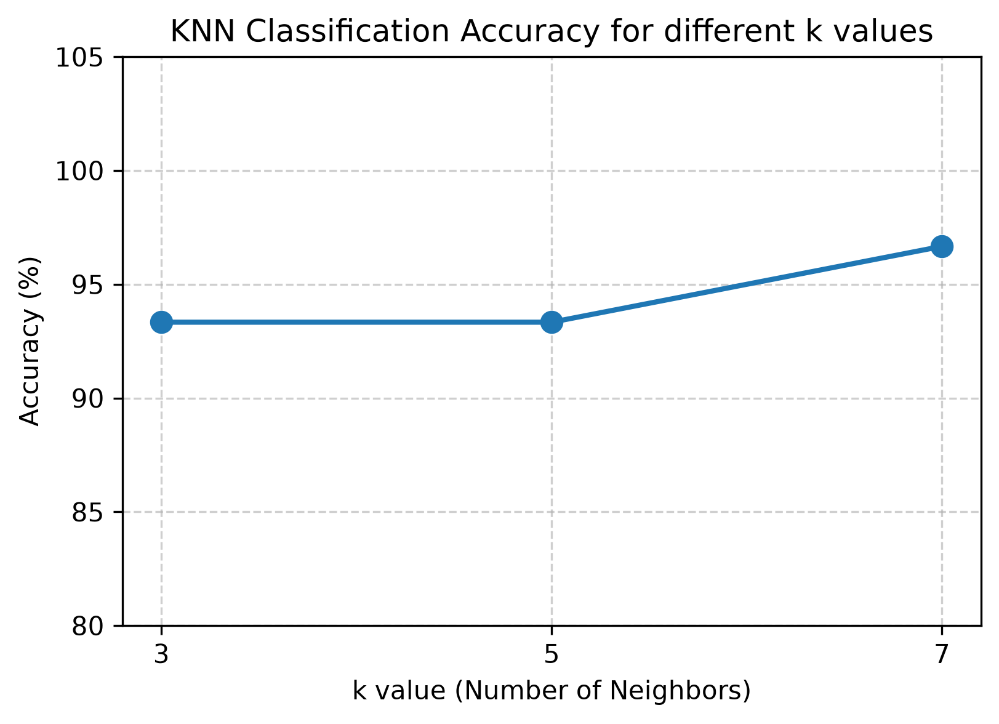
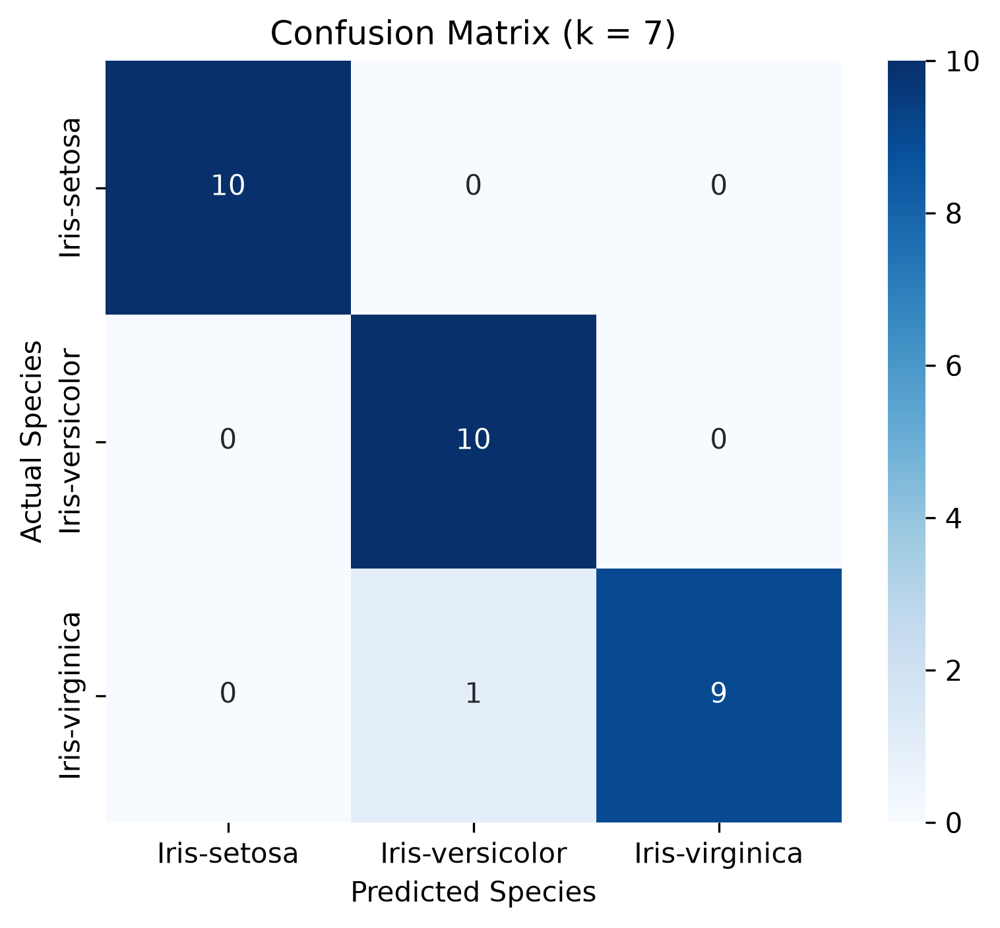

# Machine Learning Lab 04: k-Nearest Neighbor (KNN)
**รหัสวิชา:** 04-624-201 Machine Learning  
**ภาควิชาวิศวกรรมคอมพิวเตอร์ คณะวิศวกรรมศาสตร์ มหาวิทยาลัยเทคโนโลยีราชมงคลธัญบุรี**

---

## 1. วัตถุประสงค์ (Objectives)
* เพื่อให้นักศึกษาเข้าใจหลักการทำงานของ KNN และแนวทางการประยุกต์ใช้ในการจำแนกประเภท (Classification)
* เปรียบเทียบประสิทธิภาพของโมเดลเมื่อใช้จำนวนเพื่อนบ้าน (k values) ที่แตกต่างกัน เช่น k = 3, 5, 7
* เข้าใจขั้นตอนการเตรียมข้อมูล (Data Preprocessing) และการทำ Feature Standardization ก่อนนำไปเทรนโมเดล

---

## 2. ชุดข้อมูล (Dataset)
* **แหล่งที่มา:** [Kaggle - Iris Species Dataset](https://www.kaggle.com/datasets/uciml/iris)
* **จำนวนตัวอย่าง:** 150 แถว
* **Features:** 4 คอลัมน์ ได้แก่ `SepalLengthCm`, `SepalWidthCm`, `PetalLengthCm`, `PetalWidthCm`
* **Target:** 3 คลาส ได้แก่ `Iris-setosa`, `Iris-versicolor`, `Iris-virginica`

---

## 3. โครงสร้างโปรเจกต์ (Project Structure)
```text
├── images/
│   ├── k_comparison.png      # กราฟเปรียบเทียบความแม่นยำของแต่ละค่า k
│   └── confusion_matrix.png  # Confusion Matrix ของโมเดลที่ดีที่สุด
├── .gitignore
├── LAB4.py                   # สคริปต์หลักสำหรับเทรนและประเมินผล KNN
├── README.md                 # รายงานสรุปผลการทดลอง
├── Iris.csv                  # ชุดข้อมูล Iris
├── database.sqlite           # ฐานข้อมูล SQLite
└── requirements.txt          # รายการไลบรารีที่ใช้งาน
### 5.1 การเปรียบเทียบค่าความแม่นยำของแต่ละค่า k (Accuracy vs. k Value)


### 5.2 เมทริกซ์ความสับสน (Confusion Matrix)

