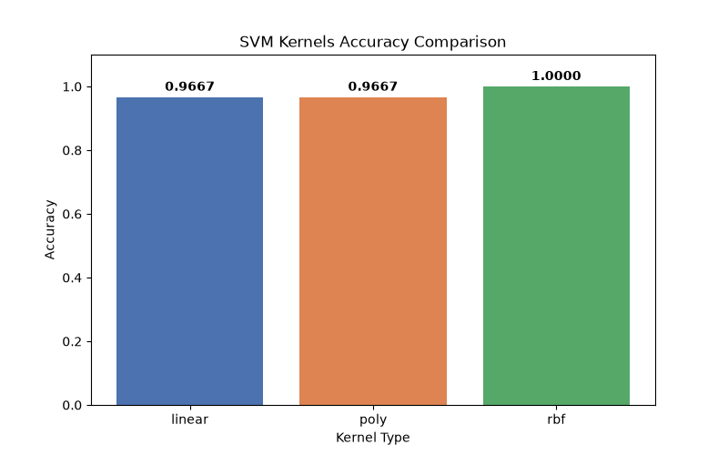
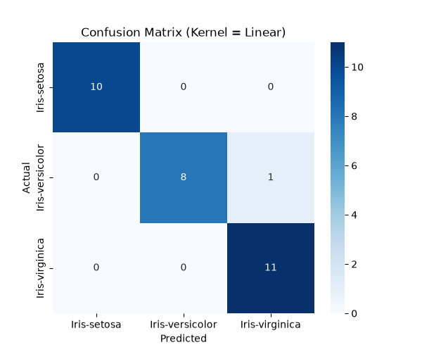

# 📈 LAB 05: Support Vector Machine (SVM) - Iris Classification

**รหัสวิชา:** 04-624-201 Machine Learning  
**ผู้จัดทำ:** ธัญพิสิษฐ์ เทพธัญญะ  

---

## Overview

This project focuses on understanding the principles of Support Vector Machines (SVM) and applying them to classification tasks. The complete workflow demonstrates how to develop a processing pipeline, evaluate performance, and accurately deploy an SVM prototype. We specifically compare the performance of three different SVM kernels: Linear, Polynomial, and RBF.

<br>

### Model Performance & Visualization

*(ภาพด้านล่างแสดงผลลัพธ์การเปรียบเทียบความแม่นยำของแต่ละเคอร์เนล และตัวอย่างเมทริกซ์ความสับสน)*

**1. Accuracy Comparison Across Kernels**

*Figure 1: Bar chart comparing the accuracy scores of Linear, Polynomial, and RBF kernels.*

**2. Confusion Matrix (Linear Kernel)**

*Figure 2: Confusion matrix showing the prediction results for the Linear kernel.*

---

## Folder Structure

```text
LAB05/
├── classification/
│   ├── data_loader.py       # โค้ดสำหรับโหลดและปรับสเกลข้อมูล
│   ├── svm_models.py        # โค้ดสร้างและเทรนโมเดล SVM ทั้ง 3 เคอร์เนล
│   ├── evaluate.py          # โค้ดประเมินผลและวาดกราฟ
│   ├── main.py              # ไฟล์สั่งการหลัก
│   └── outputs/             # โฟลเดอร์เก็บกราฟและไฟล์ CSV อัตโนมัติ
│       ├── 01_confusion_matrix_linear.png
│       ├── 01_confusion_matrix_poly.png
│       ├── 01_confusion_matrix_rbf.png
│       ├── 02_accuracy_comparison.png
│       └── predictions.csv
├── data-animal/
│   └── Iris.csv             # ชุดข้อมูลหลัก
└── README.md

## Dataset
The dataset is used to train and evaluate the SVM models. The primary objective is to classify the data into predefined categories using standardized features.

Source: Iris Dataset (data-animal/Iris.csv)

## TasksData Exploration & PreprocessingSelect and load the chosen dataset.  Separate features (X) and target labels (y).Feature Scaling: Standardize the input features before training the classification models.  Model Construction (SVM)Train Support Vector Machine (SVM) models[cite: 1].Implement and compare three specific kernels: Linear, Polynomial, and RBF[cite: 1].Evaluation & VisualizationEvaluate each model using accuracy scores[cite: 1].Generate predictions on the dataset and save them[cite: 1].Visualize confusion matrices and accuracy comparisons.Technologies UsedPythonPandas (Data manipulation)Scikit-Learn (SVM modeling & Standardization)Matplotlib / Seaborn (Data visualization)Project Replication & Commands

# 1. Check your Python installation environment
python --version

# 2. Install required data science packages
pip install pandas matplotlib seaborn scikit-learn

# 3. Navigate to the project directory
cd LAB05/classification

# 4. Execute the main pipeline script
python main.py