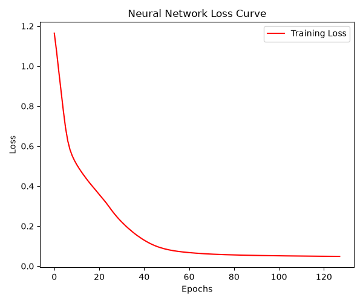

# LAB 06: Neural Network - Iris Classification

**รหัสวิชา:** 04-624-201 Machine Learning  
**ผู้จัดทำ:** ธัญพิสิษฐ์ เทพธัญญะ  

---

## Overview

This project demonstrates the application of an Artificial Neural Network (ANN) to classify the Iris dataset. The model is designed to simulate the basic working of a human brain, utilizing interconnected artificial neurons arranged in multiple layers[cite: 2]. The complete workflow covers data preprocessing, label encoding, feature scaling, model construction using Scikit-Learn's MLPClassifier, and performance evaluation through accuracy metrics and loss curve visualization.

<br>

### Model Performance Visualization

*(กราฟด้านล่างนี้แสดงค่า Loss ที่ลดลงอย่างต่อเนื่องระหว่างกระบวนการฝึกสอนโมเดล)*


*Figure 1: Neural Network Loss Curve over epochs during training.*

---

## Dataset

The dataset consists of measurements from Iris flowers, categorized into three distinct species. The primary objective is to format the data and train a Neural Network model to accurately classify the species based on these numerical features.
* **Source:** Iris Dataset (Imported from previous LAB04 data directory)

---

## Tasks

* **Data Exploration & Preprocessing**
  * Feature and Target Separation (X and y)
  * Label Encoding (Transforming categorical text labels into numeric formats `0, 1, 2`)
  * Data Splitting (Training and Testing sets using 80/20 ratio)
  * Feature Scaling (Standardizing input features using `StandardScaler` to optimize learning)

* **Model Construction (Neural Network)**
  * Multi-Layer Perceptron (MLP) Initialization
  * **Input Layer:** Receives input features[cite: 2].
  * **Hidden Layers Setup:** Configured with 2 hidden layers, containing 10 neurons each[cite: 2].
  * **Activation Function:** Applied `ReLU` (Rectified Linear Unit) to introduce non-linearity and learn complex patterns[cite: 2].
  * **Optimizer Selection:** Utilized Stochastic Gradient Descent (`SGD`) for the Backpropagation process to update weights and minimize error[cite: 2].

* **Evaluation & Visualization**
  * Feed Forward execution and prediction[cite: 2].
  * Accuracy Score Calculation
  * Training Loss Curve Plotting (Error reduction visualization)

---

## Technologies Used

* **Python**
* **Pandas** (Data manipulation)
* **Scikit-Learn** (Machine Learning algorithms and preprocessing)
* **Matplotlib** (Data visualization)

---

## Project Replication & Commands

```bash
# 1. Check your Python installation environment
python --version

# 2. Install required data science packages (if not already installed)
pip install pandas matplotlib scikit-learn

# 3. Navigate to the project directory
cd LAB06

# 4. Execute the neural network pipeline script
python classification/main.py