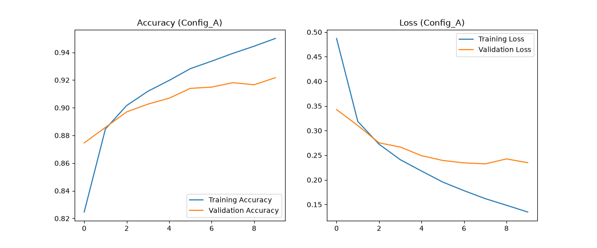
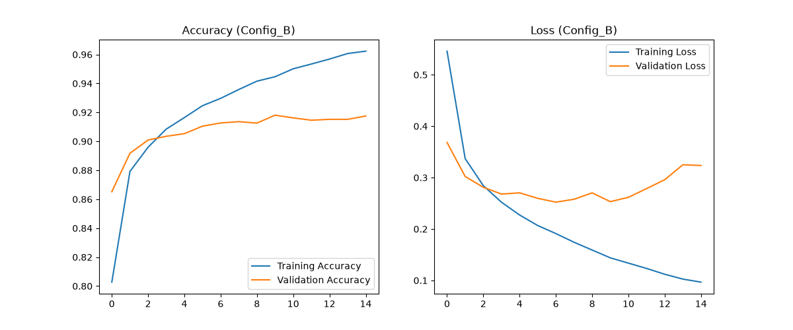

# 👕 LAB 08: Deep Convolutional Neural Network (DCNN) on Fashion-MNIST

[English Version](#english-version) | [ภาษาไทย](#thai-version)

---

<a name="english-version"></a>
## 🇬🇧 English Version

### 📁 Project Structure
```text
LAB08/
├── data_prep.py          # Data preprocessing and normalization module
├── model.py              # DCNN architecture definitions (Config A & Config B)
├── evaluate.py           # Training, evaluation, and plotting module
├── main.py               # Main execution script
├── config_a_results.png  # Training and validation graphs for Config A
├── config_b_results.png  # Training and validation graphs for Config B
└── README.md             # Project documentation

📊 Dataset & Credits
Dataset Name: Fashion-MNIST

Source / Credit: Provided by Zalando Research, hosted on Kaggle Fashion-MNIST Dataset.

Description: A dataset of Zalando's article images consisting of 60,000 training examples and 10,000 test examples. Each example is a 28x28 grayscale image, associated with a label from 10 classes.

⚙️ Model Architectures & Configurations
Config A (Shallow DCNN - 10 Epochs):

2 Convolutional Blocks (32 and 64 filters, 3x3 kernel, ReLU activation, MaxPooling 2x2).

Flatten -> Dense (128 units) -> Dropout (0.3) -> Softmax Output (10 classes).

Config B (Deeper DCNN - 15 Epochs):

3 Convolutional Blocks (32, 64, and 128 filters, 3x3 kernel, ReLU activation, MaxPooling 2x2).

Flatten -> Dense (128 units) -> Dropout (0.3) -> Softmax Output (10 classes).

 Experimental Results
1. Performance Comparison Table

Configuration,Convolutional Blocks,Epochs,Test/Val Accuracy,Test/Val Loss,Status
Config A,2 Blocks,10,95.02%,0.1345,Optimal Fit (Stable)
Config B,3 Blocks,15,91.75%,0.3230,Slight Overfitting in Later Epochs

2. Training & Validation Graphs
Config A Results (2 Conv Blocks, 10 Epochs)

Config B Results (3 Conv Blocks, 15 Epochs)

Thai Version
LAB08/
├── data_prep.py          # มอดูลโหลดและเตรียมข้อมูล Normalization
├── model.py              # มอดูลนิยามโครงสร้างแบบจำลอง DCNN (Config A และ Config B)
├── evaluate.py           # มอดูลฝึกสอน ประเมินผล และพล็อตแสดงกราฟ
├── main.py               # ไฟล์หลักสำหรับสั่งรันโปรแกรม
├── config_a_results.png  # กราฟผลการเรียนรู้ของ Config A
├── config_b_results.png  # กราฟผลการเรียนรู้ของ Config B
└── README.md             # เอกสารอธิบายโปรเจกต์

ชุดข้อมูลและแหล่งอ้างอิง (Dataset & Credits)
ชื่อชุดข้อมูล: Fashion-MNIST

แหล่งอ้างอิง / เครดิต: พัฒนาโดย Zalando Research และเผยแพร่ผ่านทาง Kaggle Fashion-MNIST Dataset

รายละเอียด: ชุดข้อมูลรูปภาพสินค้าแฟชั่นของ Zalando ประกอบด้วยข้อมูลฝึกสอน 60,000 ภาพ และข้อมูลทดสอบ 10,000 ภาพ โดยแต่ละภาพเป็นภาพขาวดำขนาด 28x28 พิกเซล แบ่งออกเป็น 10 คลาส

⚙️ โครงสร้างแบบจำลองและการทดลอง
Config A (Shallow DCNN - 10 Epochs):

ประกอบด้วย 2 Convolutional Blocks (32 และ 64 ฟิลเตอร์, Kernel 3x3, Activation ReLU, MaxPooling 2x2)

ตามด้วย Flatten -> Dense (128 ยูนิต) -> Dropout (0.3) -> Softmax Output (10 คลาส)

Config B (Deeper DCNN - 15 Epochs):

เพิ่มความลึกเป็น 3 Convolutional Blocks (32, 64 และ 128 ฟิลเตอร์) เพื่อจับแพทเทิร์นข้อมูลที่ซับซ้อนขึ้น

📈 ผลการทดลองและการวัดผล
1. ตารางเปรียบเทียบประสิทธิภาพ
Configuration,จำนวน Conv Blocks,Epochs,Test/Val Accuracy,Test/Val Loss,สถานะการเรียนรู้ (Status)
Config A,2 บล็อก,10,95.02%,0.1345,สมดุลดี (Good Fit / Stable)
Config B,3 บล็อก,15,91.75%,0.3230,เกิด Overfitting ในช่วงท้าย

2. กราฟแสดงผลการเรียนรู้ (Training & Validation Graphs)
ผลการทดลอง Config A (2 Conv Blocks, 10 Epochs)

ผลการทดลอง Config B (3 Conv Blocks, 15 Epochs)

วิธีการรันโปรแกรม
ติดตั้งแพ็กเกจที่จำเป็นผ่านเทอร์มินัล:
pip install tensorflow matplotlib numpy
สั่งรันไฟล์หลักของโปรเจกต์:
python ML-CPE/LAB08/main.py
#### 2. Training & Validation Graphs

* **Config A Results (2 Conv Blocks, 10 Epochs)**
  
  

* **Config B Results (3 Conv Blocks, 15 Epochs)**
  
  