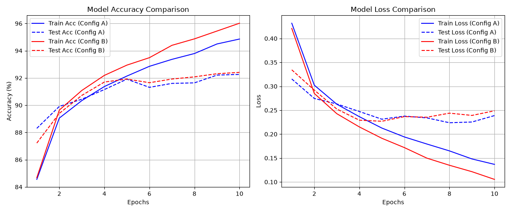

# LAB 08: Deep Convolutional Neural Network (DCNN) on Fashion-MNIST

**ชื่อผู้จัดทำ:** ธัญพิสิษฐ์ เทพธัญญะ (รหัสนักศึกษา: 116710462005-5)  
**รายวิชา:** Machine Learning / Computer Engineering, มทร.ธัญบุรี  

---

##  ภาพรวมโครงการ (Project Overview)
รายงานชิ้นนี้เป็นการทดลองพัฒนาและเปรียบเทียบประสิทธิภาพของโมเดล **Deep Convolutional Neural Network (DCNN)** บนชุดข้อมูลมาตรฐาน **Fashion-MNIST** ซึ่งประกอบด้วยภาพขาวดำขนาด $28 \times 28$ พิกเซล ของสินค้าแฟชั่น 10 ประเภท โดยมีการออกแบบโครงสร้างเครือข่ายประสาทเทียมเชิงลึก (CNN) ด้วย PyTorch ในรูปแบบที่แตกต่างกัน 2 รูปแบบ (Config A และ Config B) เพื่อวิเคราะห์ผลกระทบจากความลึกของโมเดลต่อความแม่นยำ (Accuracy) และค่าความสูญเสีย (Loss)

---

##  โครงสร้างโปรเจกต์ (Project Structure)
ภายในโฟลเดอร์ `LAB08` ประกอบด้วยไฟล์สคริปต์และทรัพยากรดังนี้:
- `data_prep.py`: จัดการดาวน์โหลดชุดข้อมูล Fashion-MNIST และเตรียม DataLoaders พร้อมทำ Data Normalization
- `model.py`: กำหนดสถาปัตยกรรมโมเดล DCNN โดยแบ่งออกเป็น 2 Config:
  - **Config A:** โมเดลแบบ 2 Convolutional Blocks (Standard DCNN)
  - **Config B:** โมเดลแบบ 3 Convolutional Blocks (Deeper DCNN)
- `evaluate.py`: ฟังก์ชันประเมินผลประสิทธิภาพของโมเดล และฟังก์ชันสำหรับสร้างรวมถึงบันทึกกราฟผลการทดลอง
- `main.py`: สคริปต์หลักในการควบคุมกระบวนการ Train, Validation และบันทึกผลลัพธ์ทั้งหมด
- `output/Figure_1.png`: กราฟแสดงผลการเปรียบเทียบค่า Accuracy และ Loss ของทั้งสองโมเดล

---

## 🔬 สถาปัตยกรรมและการทดลอง (Experimental Configurations)

1. **Config A (2 Convolutional Blocks):**
   - ประกอบด้วยชั้น Conv2d 2 บล็อก ตามด้วย Fully Connected Layers และ Dropout (0.3)
   - เหมาะสำหรับการเรียนรู้เบื้องต้น ให้ความเสถียรสูงและใช้เวลาในการประมวลผลรวดเร็ว

2. **Config B (3 Convolutional Blocks):**
   - เพิ่มความลึกของเครือข่ายเป็น 3 บล็อก เพื่อดึงลักษณะเฉพาะ (Features) ที่ซับซ้อนมากยิ่งขึ้น
   - เหมาะสำหรับการทดสอบความสามารถในการเรียนรู้เชิงลึก แต่มักพบภาวะ Overfitting ในช่วงท้ายของการเทรน

---

## 📊 ผลการทดลองและการวัดผล (Experimental Results)

กราฟเปรียบเทียบประสิทธิภาพระหว่างโมเดล Config A และ Config B (Training & Validation Accuracy/Loss):

### สรุปผลการวิเคราะห์:
- **Accuracy:** โมเดลทั้งสองรูปแบบสามารถเรียนรู้และจำแนกประเภทเสื้อผ้าได้ดี โดยอัตราความแม่นยำ (Accuracy) จะไต่ระดับขึ้นอย่างต่อเนื่องตลอดการเทรน 10 Epochs
- **Loss Analysis:** จากกราฟเปรียบเทียบจะเห็นได้ว่าโมเดลที่มีความลึกมากกว่า (Config B) เริ่มแสดงอาการ **Overfitting** ในช่วงท้าย (Loss ของชุดทดสอบเริ่มตีตัวสูงขึ้นสวนทางกับ Loss ของชุดฝึกสอน) ซึ่งเป็นกรณีศึกษาที่ดีในการเลือกปรับจำนวน Epoch หรือเพิ่มเทคนิค Regularization ให้เหมาะสมต่อไป